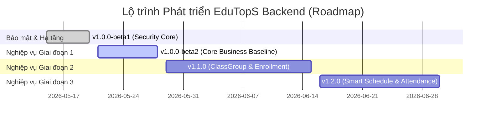

# Changelog & Product Roadmap - EduTopS Backend

Tài liệu này lưu trữ lịch sử phát triển, các thay đổi theo từng phiên bản (phiên bản hiện tại, phiên bản trước) và lộ trình phát triển chi tiết cho hệ thống quản lý vận hành trung tâm giáo dục **EduTopS**.

Định dạng nhật ký thay đổi dựa trên [Keep a Changelog](https://keepachangelog.com/en/1.1.0/) và tuân thủ quy tắc đánh số phiên bản [Semantic Versioning](https://semver.org/spec/v2.0.0.html).

---

## 🔮 Lộ trình Phát triển (Product Roadmap)

---

## [Chưa phát hành - v1.0.0-beta2] - (Core Business Baseline)

Phiên bản này tập trung hoàn thiện các nghiệp vụ cơ bản của Giai đoạn 1 (Teacher & Course), tối ưu hóa trải nghiệm đăng nhập Google và chuẩn bị phân quyền chi tiết cho vai trò Quản lý lớp học (`CLASS_MANAGER`).

### Added (Sắp thêm mới)
* **Khóa học có thời hạn đào tạo**: Bổ sung ngày bắt đầu (`startDate`) và ngày kết thúc (`endDate`) vào thực thể Khóa học (`Course`) kèm theo các ràng buộc kiểm tra nghiệp vụ (`startDate <= endDate`).
* **Vai trò Quản lý lớp học (`CLASS_MANAGER`)**: Thêm vai trò mới vào hệ thống phân quyền trong `UserRole.java`.
* **API Hoàn tất hồ sơ cá nhân**: Endpoint `POST /api/v1/students/user/{userPublicId}/complete-profile` bảo mật cao cho phép người dùng tự điền số điện thoại, ngày sinh và giới tính thật sau khi đăng nhập qua Google.
* **Cấu hình Authorize Swagger UI**: Tích hợp Bearer JWT Token Scheme trực tiếp vào tài liệu Swagger giúp lập trình viên kiểm thử phân quyền REST APIs trực quan.

### Changed (Sắp thay đổi)
* **Tối ưu hóa luồng Google Login**: Loại bỏ việc tự động tạo thực thể `Student` với dữ liệu rác (dummy data) ban đầu. Hệ thống sẽ trả về cờ `profileCompleted = false` để thông báo cho Frontend yêu cầu điền hồ sơ thật.
* **Phân quyền Quản lý lớp học**: Cập nhật `@PreAuthorize` trên `StudentController` và `TeacherController` cho phép `CLASS_MANAGER` được quyền đọc hồ sơ nhân sự (Giáo viên, Học viên) để thực hiện điều phối ghép lớp học về sau.

### Fixed (Sắp sửa đổi)
* **Sửa lỗi DDL PostgreSQL**: Khắc phục lỗi không thể chạy tự động cập nhật schema (`alter table add column deleted boolean not null`) trên các bảng đã có dữ liệu cũ bằng cách bổ sung cấu hình `default false` trong thực thể `BaseEntity.java`.

---

## [v1.0.0-beta1] - 2026-05-28 - (Security Core Infrastructure)

Phiên bản đầu tiên thiết lập hạ tầng bảo mật vững chắc, cơ cấu Generic CRUD và module nghiệp vụ môn học gốc làm nền tảng.

### Added (Đã thêm mới)
* **Cơ chế Bảo mật Spring Security & JWT**:
  * Tích hợp Nimbus JWT để ký số và xác thực Token JWT bất đối xứng.
  * Cấu hình Resource Server tự động giải mã và trích xuất GrantedAuthority từ Claim `role` trong JWT token.
  * Hỗ trợ Method Security cấp độ phương thức bằng `@EnableMethodSecurity` và `@PreAuthorize`.
* **Bảo mật phân quyền chính chủ nâng cao (`SecurityUtils`)**:
  * Xây dựng helper bean `@securityUtils` trong SpEL để kiểm tra xem ID tài nguyên có thực sự thuộc quyền sở hữu của JWT đang đăng nhập hay không, triệt tiêu lỗi cú pháp SpEL phức tạp.
* **Hạ tầng Generic CRUD & Exception Handling**:
  * Xây dựng bộ khung generic chuẩn (`BaseEntity`, `BaseRepository`, `BaseService`, `BaseServiceImpl`, `BaseController`) giúp phát triển nhanh các API CRUD.
  * Tạo cấu trúc kiểm soát lỗi tập trung `GlobalExceptionHandler` đi kèm định nghĩa mã lỗi nghiệp vụ thống nhất trong `ErrorCode.java`.
* **Ràng buộc Validation tập trung**:
  * Tạo tệp `ValidationMessages.properties` để gom toàn bộ các thông điệp thông báo lỗi nhập liệu về một nơi tập trung (phi-hardcode).
* **Xác thực Google Sign-In**:
  * Tích hợp thư viện Google API Client để kiểm tra độ tin cậy của Google ID Token trực tiếp từ hệ thống của Google.
* **Module Môn học (Subject)**:
  * Triển khai đầy đủ APIs CRUD môn học và phân quyền bảo mật (chỉ ADMIN được thay đổi, mọi người dùng được xem).

---

## [Kế hoạch Tương lai - v1.1.0] - (ClassGroup & Enrollment)

Phiên bản trung tâm của Giai đoạn 2 giúp Quản lý lớp học vận hành và ghép lớp thực tế.

### Added (Lộ trình thêm mới)
* **Module Lớp học (ClassGroup)**: Thực thể lớp học cụ thể thuộc về khóa học và do giáo viên chủ nhiệm giảng dạy.
* **Module Đăng ký học (Enrollment)**: Cho phép thêm học sinh vào lớp học học tập.

### Optimizations (Tối ưu hóa tương lai)
* **Kiểm tra Sức chứa lớp học**: Hệ thống tự động đếm sĩ số lớp thực tế và chặn ghi danh nếu vượt quá sĩ số tối đa cho phép (`maxStudents`).
* **Đảm bảo tính hợp lệ của Giáo viên**: Kiểm tra danh sách môn dạy giảng dạy của Giáo viên trước khi phân công vào dạy Lớp học của khóa học tương ứng.
* **Quyền hạn Quản lý lớp học**: Cho phép `CLASS_MANAGER` toàn quyền khởi tạo lớp học, đổi giáo viên phụ trách và thêm/bớt học sinh ra khỏi lớp học.

---

## [Kế hoạch Tương lai - v1.2.0] - (Smart Schedule & Attendance)

Phiên bản tối ưu hóa tự động của Giai đoạn 3 giúp xếp lịch thông minh và giám sát chuyên cần.

### Added (Lộ trình thêm mới)
* **Lập lịch học lặp lại (Schedule)**: Cho phép đăng ký lịch học lặp lại nhiều ngày trong tuần (2-4-6, 3-5-7) dưới dạng checkbox.
* **Điểm danh (Attendance)**: Module điểm danh từng buổi học cụ thể cho lớp học.

### Optimizations (Tối ưu hóa tương lai)
* **Thuật toán tránh trùng lịch (Collision Detection)**: 
  * Tự động kiểm tra trùng giờ dạy của Giáo viên trên toàn hệ thống và chặn xếp lịch nếu giáo viên bị trùng giờ dạy.
  * Tự động kiểm tra tính khả dụng của Phòng học (`Room`) trong cùng khung giờ và thứ trong tuần.
  * Kiểm tra sức chứa tối đa của phòng học (`capacity`) đảm bảo chứa vừa sĩ số lớp học.
